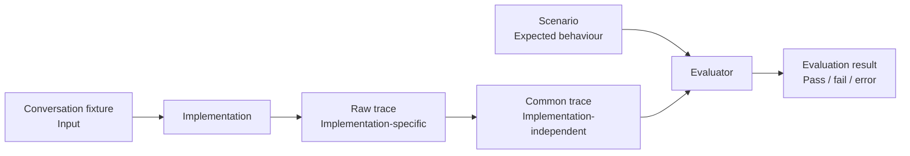

# Evaluation

This directory contains the implementation-independent evaluation framework used
to compare different approaches to consuming server-driven service journeys.

The evaluation deliberately separates four things:

1. **Input** — a conversation fixture containing information available to an
   implementation.
2. **Expectation** — a scenario describing the semantic behaviour and journey
   outcome that should be observed.
3. **Observation** — an implementation-specific raw trace, converted to a common
   semantic trace.
4. **Evaluation** — comparison of the common trace with the scenario, producing
   a structured pass, fail or error result.



The service remains authoritative about journey progression. Implementations
supply results for the current interaction; they do not independently choose the
next journey step.

## Running the current prototype

Start the mock DVLA service and journey application, authenticate for the model
provider, then run:

```bash
gds-cli aws once-ailegibility-development-admin \
  uv run python -m agents.src.scenario_evaluation.run \
  agents/evaluation/scenarios/change-driving-licence-address
```

This performs the complete pipeline:

```text
scenario
  ↓
conversation fixture
  ↓
implementation
  ↓
raw trace
  ↓
common trace
  ↓
scenario evaluator
  ↓
evaluation result
```

The current runner simulates a cooperative user accepting agent-proposed values
without editing them. Service-owned confirmation is supplied by the test harness
rather than inferred by the agent.

To repeat each scenario and bound the number of executions in flight:

```bash
gds-cli aws once-ailegibility-development-admin \
  uv run python -m agents.src.scenario_evaluation.run \
  agents/evaluation/scenarios/change-driving-licence-address \
  --repeat 1000 \
  --concurrency 10
```

`--repeat` is the number of executions of each scenario. `--concurrency`
controls the maximum number of executions running at once.

## Evaluation outputs

Each execution retains its evidence under:

```text
.traces/evaluation-runs/<scenario>/<run-id>/
├── raw.jsonl
├── common/
│   └── raw.common.yaml
└── evaluation.json
```

`raw.jsonl` records implementation-specific behaviour,
`common/raw.common.yaml` is the normalized semantic trace, and
`evaluation.json` records the structured comparison result.

Each invocation also creates a batch directory:

```text
.traces/evaluation-batches/<batch-id>/
├── batch.json
├── results.jsonl
└── summary.json
```

`results.jsonl` contains one compact record per execution and is written as runs
complete. `summary.json` contains aggregate pass, fail and error counts.

The three outcomes have different meanings:

- `pass` — the implementation ran and satisfied the scenario;
- `fail` — the implementation ran but violated one or more expectations;
- `error` — execution or evaluation could not be completed.

Keeping failures separate from execution errors is important when scenarios are
repeated at scale.

## Further documentation

- [`scenarios/README.md`](scenarios/README.md) explains how to define scenarios,
  expectations and accepted equivalent outputs.
- [`../src/scenario_evaluation/README.md`](../src/scenario_evaluation/README.md)
  documents the evaluator, regression commands and current prototype runner.
