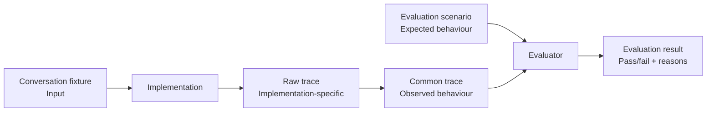

# Evaluation scenarios

These scenarios define implementation-independent inputs and expected behaviour
for comparing different ways of consuming the same service journey.

Version `0.1` uses conversation-history fixtures only.

## How evaluation fits together

An evaluation uses three separate artefacts:

- **Conversation fixture** — the input presented to an implementation.
- **Evaluation scenario** — the expected semantic behaviour and journey outcome.
- **Common trace** — an implementation-independent record of what actually happened.

The evaluation scenario is **not an expected common trace**. It specifies
requirements that the observed trace must satisfy, rather than prescribing
the exact events or event ordering an implementation must produce.

An evaluator compares the common trace produced by a run with the
expectations in the scenario and reports whether those expectations were met.

This directory contains the _Evaluation scenario_. Each scenario references a conversation fixture
containing the test input, and defines the expected assistance behaviour, journey branch and final outcome.
The scenario is not an expected common trace; it describes the requirements that a common trace produced by any implementation should satisfy.



## One source of truth

Conversation fixtures are inputs only. They contain the conversation presented
to an implementation and must not contain expected results.

Scenario YAML is the single source of truth for expected behaviour. A scenario
references a conversation fixture and defines:

- the assistance expected at each relevant journey interaction;
- the semantic branch expected through the journey;
- the expected final journey status and values.

The common trace records what actually happened. The evaluator compares that
trace with the scenario.

Scenario expectations are opt-in. An implementation is evaluated only against
the dimensions present in `expected`. For example, a scenario containing only
`expected.journey.branch` can be used to compare branching without evaluating
assistance or the final result.

If `expected.assistance` is present, it is exhaustive: assistance observed at
an interaction that is not listed is treated as unexpected.

## Conversation fixture references

`input.conversation_fixture.id` refers to the stable `id` inside a JSON fixture
in `agents/src/evaluation/fixtures/`; it is not a filename.

For example:

```yaml
input:
  conversation_fixture:
    id: "complete-address-postcode-lookup"
    version: "1"
```

currently resolves to:

`agents/src/evaluation/fixtures/complete_address_postcode_lookup.json`

The filename is therefore only a repository convention; fixture resolution
should use the ID and version.

## Expected assistance

`expected.assistance` is keyed by a semantic journey interaction. Each entry
describes the assistance that should be observable at that point, including
proposed values where relevant.

For example:

```yaml
expected:
  assistance:
    enter_address_manually:
      type: "propose_values"
      values:
        address_line_1: "Flat 4"
        address_line_2: "81 Station Road"
        town_or_city: "Bristol"
        postcode: "BS1 3AB"
```

When `expected.assistance` is present, the assistance mapping is exhaustive for the scenario. If an implementation
produces assistance at an interaction that is not listed, that is an unexpected
output. This lets a safe-withholding case omit `enter_address_manually`
entirely: proposing the other person's address would then fail the scenario
without requiring a common `no_safe_suggestion` event.

Semantic action names describe observable behaviour. An implementation does
not need to expose a tool with the same name.

## Expected journey outcome

`expected.journey.branch` describes the semantic route through the service,
independently of how an implementation represents its control flow.

`expected.journey.final` optionally describes the expected end-to-end outcome.
Its structure corresponds to the terminal outcome represented by
`journey_finished` in the common trace.

For example:

```yaml
expected:
  journey:
    branch: "postcode_lookup"
    final:
      status: "completed"
      result:
        new_address:
          address_line_1: "18 Station Road"
          address_line_2: null
          town_or_city: "Bristol"
          postcode: "BS1 3AB"
```

`branch`, `final.status` and `final.result` are independent expectations. A
scenario can omit any of them when that dimension is not relevant to the test.

## Equivalent outputs

Values are compared exactly by default. A scenario can explicitly allow
multiple representations when they are semantically equivalent.

For example, an address may validly be represented as:

```text
address_line_1: Flat 4
address_line_2: 81 Station Road
```

or:

```text
address_line_1: Flat 4, 81 Station Road
address_line_2: null
```

Scenarios can use `evaluation.accepted_equivalence_rules` to permit this without
weakening comparison of the other fields:

```yaml
evaluation:
  accepted_equivalence_rules:
    - type: "unordered_text_components"
      target: "expected.assistance.enter_address_manually.values"
      paths:
        - "address_line_1"
        - "address_line_2"

    - type: "unordered_text_components"
      target: "expected.journey.final.result"
      paths:
        - "new_address.address_line_1"
        - "new_address.address_line_2"
```

Equivalence rules apply only to the explicitly named target and paths. Other
values continue to require exact equality.

`accepted_values` can be used when a single field has a small set of explicitly
acceptable representations:

```yaml
evaluation:
  accepted_equivalence_rules:
    - type: "accepted_values"
      target: >-
        expected.assistance.find_address_by_postcode.values.building_number_or_name
      values:
        - "18"
        - "18 Station Road"
```

Values not listed in the rule still fail the expectation.

### Running the evaluator

Evaluation of an existing common trace is implemented.

To compare one scenario with one common trace:

```bash
uv run python -m agents.src.scenario_evaluation \
  agents/evaluation/scenarios/change-driving-licence-address/manual-entry.yaml \
  path/to/common-trace.yaml
```

The evaluator reports whether the observed common trace satisfies the
expectations in the scenario, with reasons for any mismatch.

The evaluator itself does not run an agent or service journey and does not
require model or AWS credentials. It operates only on the scenario and an
already-produced common trace.

### Regression examples

Known scenario/trace pairs can be evaluated together using the regression
manifest:

```bash
uv run python -m agents.src.scenario_evaluation.batch \
  agents/evaluation/regression/common-trace-examples.yaml
```

Use `--verbose` to show the reasons for expected evaluation failures:

```bash
uv run python -m agents.src.scenario_evaluation.batch \
  agents/evaluation/regression/common-trace-examples.yaml \
  --verbose
```

The regression manifest can contain both:

* compliant traces that are expected to pass; and
* historical traces that are expected to fail evaluation for known reasons.

An expected evaluation failure therefore counts as a passing regression test:
the regression is checking that the evaluator continues to reject that
behaviour.

## End-to-end execution

The current prototype has an implementation-specific runner that executes
scenarios end to end, produces raw and common traces, and evaluates the result.

See [`../README.md`](../README.md) for the overall evaluation process and
[`../../src/scenario_evaluation/README.md`](../../src/scenario_evaluation/README.md)
for runner commands, repeated execution and batch outputs.

Different implementations may use different runners and raw traces, but they
should consume the same scenarios and ultimately be evaluated against the same
expectations.
