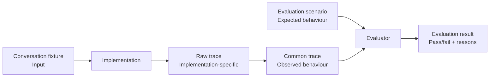

# Evaluation scenarios

These scenarios define implementation-independent inputs and expected behaviour
for comparing different ways of consuming the same service journey.

Version `0.1` uses conversation-history fixtures only.

## How evaluation fits together

An evaluation uses three separate artefacts:

- **Conversation fixture** — the input presented to an implementation.
- **Evaluation scenario** — the expected semantic behaviour and journey outcome.
- **Common trace** — an implementation-independent record of what actually happened.

The evaluation scenario is **not an expected common trace**. It specifies
requirements that the observed trace must satisfy, rather than prescribing
the exact events or event ordering an implementation must produce.

An evaluator compares the common trace produced by a run with the
expectations in the scenario and reports whether those expectations were met.

This directory contains the _Evaluation scenario_. Each scenario references a conversation fixture
containing the test input, and defines the expected assistance behaviour, journey branch and final outcome.
The scenario is not an expected common trace; it describes the requirements that a common trace produced by any implementation should satisfy.



## One source of truth

Conversation fixtures are inputs only. They contain the conversation presented
to an implementation and must not contain expected results.

Scenario YAML is the single source of truth for expected behaviour. A scenario
references a conversation fixture and defines:

- the assistance expected at each relevant journey interaction;
- the semantic branch expected through the journey;
- the expected final journey status and values.

The common trace records what actually happened. The evaluator will compare
that trace with the scenario.

## Conversation fixture references

`input.conversation_fixture.id` refers to the stable `id` inside a JSON fixture
in `agents/src/evaluation/fixtures/`; it is not a filename.

For example:

```yaml
input:
  conversation_fixture:
    id: "complete-address-postcode-lookup"
    version: "1"
```

currently resolves to:

`agents/src/evaluation/fixtures/complete_address_postcode_lookup.json`

The filename is therefore only a repository convention; fixture resolution
should use the ID and version.

## Expected assistance

`expected.assistance` is keyed by a semantic journey interaction. Each entry
describes the assistance that should be observable at that point, including
proposed values where relevant.

For example:

```yaml
expected:
  assistance:
    enter_address_manually:
      type: "propose_values"
      values:
        address_line_1: "Flat 4"
        address_line_2: "81 Station Road"
        town_or_city: "Bristol"
        postcode: "BS1 3AB"
```

The assistance mapping is exhaustive for the scenario. If an implementation
produces assistance at an interaction that is not listed, that is an unexpected
output. This lets a safe-withholding case omit `enter_address_manually`
entirely: proposing the other person's address would then fail the scenario
without requiring a common `no_safe_suggestion` event.

Semantic action names describe observable behaviour. An implementation does
not need to expose a tool with the same name.

## Expected journey outcome

`expected.journey.branch` describes the semantic route through the service,
independently of how an implementation represents its control flow.

`expected.journey.final` describes the expected end-to-end outcome. For a
completed change-of-address journey, `values` describes the final address that
the service should have received.

## Intended execution flow

Scenario execution is not implemented yet. The intended flow is:

1. Load the scenario YAML and resolve its conversation fixture.
2. Run the specified journey through an implementation using that fixture.
3. Capture the implementation-specific raw trace.
4. Convert the raw trace to the common trace format.
5. Compare the common trace with `expected` and report pass/fail reasons.

Different implementations may use different runners and raw traces, but they
should consume the same scenario and be evaluated against the same
expectations.

Expectations describe semantic requirements rather than an exact event
sequence. Event order only matters where required by the journey's causal
behaviour.
