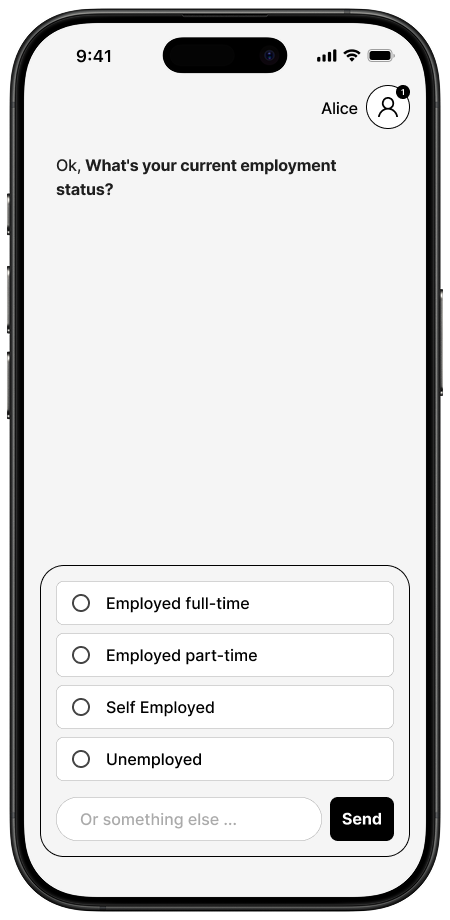

## What do legible transactions look like?

::: {.medium}
Why determinism matters.
:::

:::: {.columns}

::: {.column width="50%"}
- Driving license renewal. 
- Assume it's available through the App.
- App ↔ Flex ↔ DVLA
:::

::: {.column width="50%"}
- The same facts must follow the same route.
- No required step can be missed.
- Transitions must be reliable.
:::

::::

## {background-iframe="child_benefit_decision_tree_gds.html" background-interactive="true"}

## Was this deterministic?

::: {.lede}
Intuition: it should be.
:::

::: {.big .fragment}
No.
:::

::: {.fragment}
- A model is constrained to select the next node.
- We gave the same model given the same info multiple times.
- _It didn't always pick the same node_.
:::

## How do we make journeys legible and reliable?

::: {.lede}
Not just the backend.
:::

:::: {.columns}

::: {.column width="50%"}
{width=40% fig-align="center"}
:::

::: {.column width="50%"}
- What service journey data structures do we need? 
- Who provides this - and if departments, how?
- How do we render this?
- How do we get the most out of an agent?
:::

::::

## Next steps {.diagram-overlay background-iframe="diagram-viewer.html" background-interactive="true" .smaller}

1. Define the journey execution layer.
    - Build _Get Driving License Info_ journey through Flex.
    - Incrementally increase complexity.
    - Evaluate routing, token usage, latency.

2. Flex authentication and integration.

3. Define boundary and hand-off with Chat.

