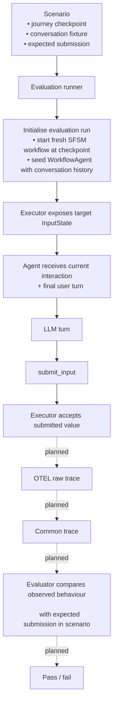

# Durable workflow evaluation

This directory contains evaluation tooling for the durable SFSM prototype.

The aim is to test a narrow question repeatedly and reproducibly:

> **Given a real service interaction, a realistic conversation history, and a user message, does the agent submit the correct structured value to the deterministic journey executor?**

The evaluation should exercise the real agent and the real executor, while avoiding the cost and noise of replaying every earlier step in a long service journey for every test case.

## Planned architecture



There are two kinds of state in a targeted evaluation:

1. **Journey state**: where the deterministic executor is, including the process, state and any variables/inputs needed at that point.
2. **Conversation state**: what the agent has already seen before the user turn under test.

These are related in a real journey, but they do not need to be reconstructed in the same way for an evaluation. A runner can initialise the executor at a known semantic state and independently seed the agent with a realistic conversation prefix.

## Why use an executor checkpoint?

`SFSMInterpreter.run()` accepts an optional `initial_state`. This lets an evaluation start a **new, real Temporal workflow** at a chosen SFSM state rather than replaying the whole service from its entry point.

For example, the first Maternity Allowance scenario targets:

```yaml
checkpoint:
  process_id: section2_about_baby
  state_id: prompt_is_baby_born
```

The runner builds an `InterpreterState` for that point and starts:

```text
SFSMInterpreter.run(definition, initial_state=checkpoint)
```

From then on, execution is normal. The executor creates a real `AwaitingInput`, the real agent sees that interaction, the model chooses whether and how to call `submit_input`, and the executor validates the submitted value.

This is not intended to fake the behaviour under test. It treats the deterministic journey before the target interaction as **test setup**.

## This is not a Temporal event-history checkpoint

Temporal's durable source of truth is its event history. A worker can reconstruct workflow state by replaying that history, but the history contains a large amount of infrastructure detail: workflow tasks, activities, updates, retries, timers and other Temporal mechanics.

For these evaluations, that is usually the wrong level of abstraction. We are testing agent behaviour at a service interaction, not Temporal replay itself.

The preferred checkpoint is therefore a **semantic executor checkpoint**: a serialisable `InterpreterState` containing enough SFSM state to legitimately resume execution from the target interaction.

For early states this can be constructed from the workflow definition. Deeper checkpoints can also supply the process variables and invocation inputs that would already exist at that point. For example:

```yaml
checkpoint:
  process_id: "section4_about_payment"
  state_id: "prompt_date_stopped_work"
  vars:
    reason_stopped_work: "pregnancy_sick_leave"
  input:
    is_baby_born: false
    calculated_dates:
      smp_qualifying_week: "27/08/2026"
      earliest_signing_date: "03/09/2026"
```

The checkpoint only needs to contain state that is meaningful for execution from the target interaction onwards. As scenarios move deeper into journeys, we expect to add a helper that captures this semantic `InterpreterState` from a successful interactive run rather than maintaining it manually.

Conceptually:

```text
run a real journey once
        |
        v
reach interaction X
        |
        +--> capture InterpreterState
        |
        +--> capture realistic conversation prefix
        |
        v
reuse both for many targeted evaluation runs
```

We should only introduce raw Temporal-history replay if we later have a specific need to test Temporal recovery, retries or other infrastructure behaviour.

## Scenarios

Scenarios are intended to remain implementation-independent. They say **what service situation is being tested and what result is expected**, not how a particular deployment reaches that situation.

Example:

```yaml
schema_version: "0.1"

id: "ma-baby-not-born"
journey_id: "dwp.maternity_allowance_ma1_claim"

input:
  conversation_fixture:
    id: "ma-baby-not-born"
    version: "1"
  checkpoint:
    process_id: "section2_about_baby"
    state_id: "prompt_is_baby_born"

expected:
  submissions:
    prompt_is_baby_born:
      values:
        is_baby_born: false
```

The checkpoint identifies the current executor interaction. The fixture supplies the preceding conversation and the final user turn. The expectation describes the semantic value that should ultimately be accepted by the executor.

At present, `expected.submissions` is recorded but **not yet scored** by the checkpoint runner.

## Conversation fixtures

A fixture contains the user-visible conversation leading up to the turn being tested. The final user message is the turn under test.

The runner splits the fixture into:

```text
all preceding messages  -> seeded agent conversation history
final user message       -> current turn under test
```

The authoritative current service prompt comes from the live executor state, not from the fixture. If the fixture ends its history with a copy of that assistant prompt, the current runner removes the duplicate before initialising the agent.

This keeps two things true at once:

- the model gets realistic conversational context;
- the current service contract still comes from the actual running journey definition.

For early scenarios, conversation prefixes may be reconstructed from the journey definition and deterministic stub responses. This is useful for realistic context, but it is not the same as recovering a user's exact previous utterances from Temporal. Temporal workflow start input contains the workflow definition; the agent's user-visible conversation is separate state.

A future checkpoint-capture tool should capture both the semantic executor state and the user-visible conversation prefix from a real browser journey so that deeper cases do not need to maintain either by hand.

## Current runner

`checkpoint_runner.py` currently performs a targeted smoke run:

```text
load scenario and fixture
        |
        v
build InterpreterState for target interaction
        |
        v
start a fresh Temporal workflow
        |
        v
wait for the real executor to expose AwaitingInput
        |
        v
create a fresh WorkflowAgent with fixture history
        |
        v
send the final user message
        |
        v
agent calls the normal workflow tools
        |
        v
print the next executor state
        |
        v
terminate the test workflow
```

Each repetition uses a new Temporal workflow ID and a new agent instance. This makes repeated runs independent of one another.

For example, from `durable_poc/`:

```bash
gds-cli aws <profile> -- \
  uv run python -m evaluation.checkpoint_runner \
  ../agents/evaluation/scenarios/maternity-allowance/baby-not-born.yaml
```

A deeper checkpoint works in the same way:

```bash
gds-cli aws <profile> -- \
  uv run python -m evaluation.checkpoint_runner \
  ../agents/evaluation/scenarios/maternity-allowance/date-stopped-work-natural-language.yaml
```

Run the same case repeatedly with bounded concurrency:

```bash
gds-cli aws <profile> -- \
  uv run python -m evaluation.checkpoint_runner \
  ../agents/evaluation/scenarios/maternity-allowance/baby-not-born.yaml \
  --repeat 10 \
  --concurrency 5
```

The runner currently prints execution progress only. Reaching the expected next state can be a useful smoke-test signal, but it is **not the eventual evaluation result**: downstream deterministic routing should not be used as a proxy for the model's submitted value once tracing is available.

## Planned tracing and evaluation

The next stage is to connect this runner to the existing common-trace evaluation framework.

The intended pipeline is:

```text
scenario
  -> targeted real agent/executor run
  -> raw OTEL spans
  -> common semantic trace
  -> deterministic evaluator
  -> pass/fail
```

The common trace should discard implementation mechanics and retain only evaluation-relevant semantic events. For this class of scenario the important events are expected to be approximately:

```yaml
events:
  - type: interaction_available
    interaction_id: prompt_is_baby_born

  - type: values_submitted
    interaction_id: prompt_is_baby_born
    values:
      is_baby_born: false
```

The evaluator can then compare `expected.submissions` in the scenario with the value actually accepted by the executor.

The trace, rather than the runner's knowledge of the graph, should determine the semantic result. This keeps evaluation separate from execution and avoids building a second bespoke scoring path for targeted tests.

## Repeated runs

Repeated runs are important because LLM behaviour is stochastic. `--repeat` should therefore create independent executions of the same scenario rather than continuing or branching one existing workflow.

The planned aggregate result can eventually report information such as:

```text
scenario: ma-baby-not-born
runs: 100
passed: 98
failed: 2
execution_errors: 0
```

The raw/common traces should remain available for investigating individual failures.

## Deployment independence

The current prototype is split across several local processes, and `checkpoint_runner.py` currently talks directly to local Temporal and constructs `WorkflowAgent` in-process. That is an implementation detail, not part of the scenario model.

If the durable prototype is deployed, the preferred direction is to change the **runner/adapter**, for example from:

```text
local runner -> local Temporal + local WorkflowAgent
```

to:

```text
runner -> deployed evaluation/runtime endpoints
```

without changing the scenario, conversation fixture, semantic checkpoint or expectation.

Configuration such as Temporal addresses, task queues, model IDs and service endpoints should therefore stay in runner configuration/environment variables rather than being embedded in scenarios.

## Design principles

- **Test LLM autonomy, not deterministic graph routing.** Choice states and other deterministic executor behaviour should be covered by executor tests rather than duplicated as LLM evals.
- **Use the real input contract.** The current prompt and schema should come from the live workflow definition/executor.
- **Preserve realistic conversation context.** A targeted state with no plausible prior conversation can produce an unrealistic agent task.
- **Treat earlier deterministic journey execution as setup.** Do not replay fifteen unrelated interactions merely to reach the state under test.
- **Prefer semantic checkpoints over infrastructure histories.** Save the state the SFSM needs, not Temporal implementation detail, unless Temporal behaviour is itself the thing being tested.
- **Use traces for scoring.** The runner should execute; the common-trace evaluator should decide pass/fail.
- **Keep scenarios stable across deployment changes.** Infrastructure should be replaceable without rewriting the evaluation corpus.

## Current status

The first two Maternity Allowance scenarios prove the basic targeted-run approach:

- a fresh workflow can start at `section2_about_baby / prompt_is_baby_born`;
- a deeper run can start at `section4_about_payment / prompt_date_stopped_work` with the required process variables and invocation inputs;
- the agent can be seeded with a realistic preceding conversation history;
- the final fixture turn can be sent through the real `WorkflowAgent`;
- repeated runs can be launched independently and concurrently.

Still to add:

- automatic capture/reuse of semantic `InterpreterState` checkpoints from interactive runs;
- convenient capture of real user-visible conversation prefixes from interactive runs;
- OTEL-to-common-trace conversion for durable runs;
- deterministic scoring of `expected.submissions`;
- aggregate reporting across repeated runs.
